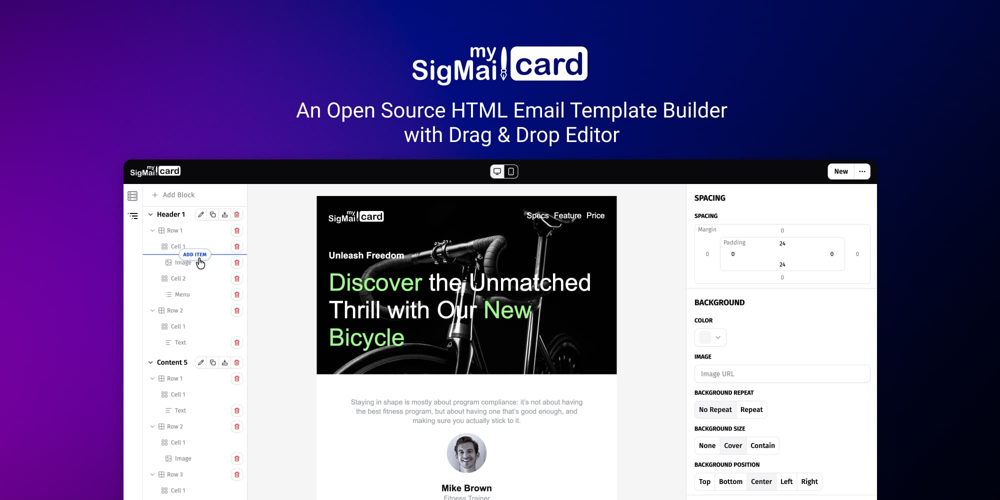
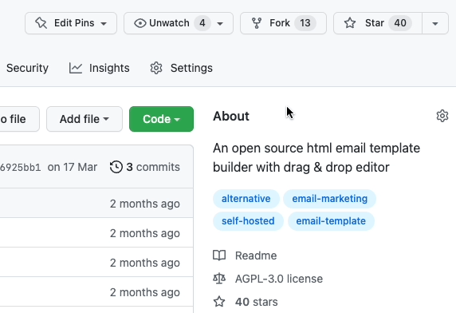

<h1 align="center">MySigMail Card</h1>

An open source html email template builder with drag & drop editor

## Motivation

In the world of development there are more and more dependencies and vendor-locked. There are situations where entire nations are "cancelled" for political reasons. Ordinary people suffer. It shouldn't be. 

I love open source, and I contribute to it. Right now I want to give back to the community my commercial project [MySigMail Card](https://card.mysigmail.com). 

## Development path

The project was written almost 3 years ago and so its code base is outdated. So before I give it to the community I will rewrite it from scratch using modern solutions. 

## How can I help?

In the process of writing from scratch I think there will be a lot of rethinking, so no help is needed until I get a stable release. But I don't mind if someone else wants to. 

Now a good help would be your recognition and star for the project to gain visibility on GitHub.

## Follow

- News and updates on [Twitter](https://twitter.com/mysigmail).
- [Discussions](https://github.com/mysigmail/card/discussions)

## License

[AGPL-3.0](https://github.com/mysigmail/card/blob/master/LICENSE)

Copyright (c) 2022-present, Anton Reshetov.